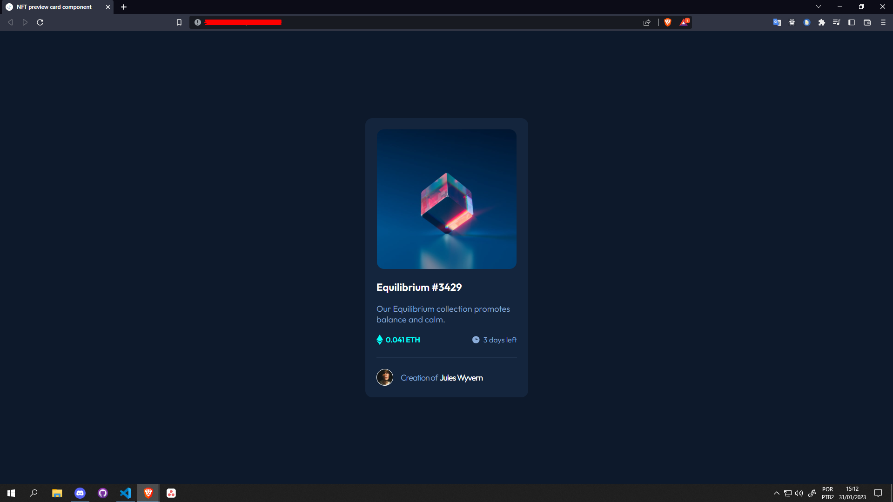
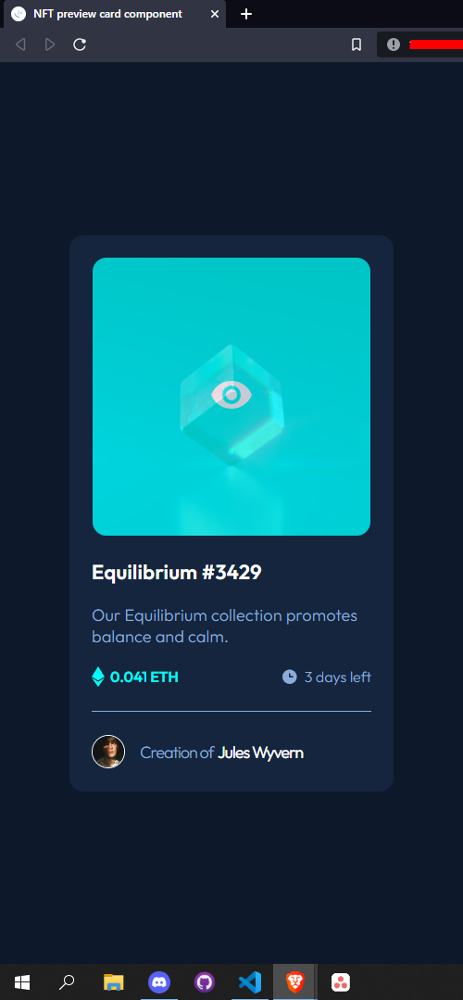

# Frontend Mentor - NFT preview card component solution

This is a solution to the [NFT preview card component challenge on Frontend Mentor](https://www.frontendmentor.io/challenges/nft-preview-card-component-SbdUL_w0U). Frontend Mentor challenges help you improve your coding skills by building realistic projects.

## Table of contents

- [Overview](#overview)
  - [The challenge](#the-challenge)
  - [Screenshot](#screenshot)
  - [Links](#links)
- [My process](#my-process)
  - [Built with](#built-with)
  - [What I learned](#what-i-learned)
  - [Continued development](#continued-development)
  - [Useful resources](#useful-resources)
- [Author](#author)
- [Acknowledgments](#acknowledgments)

## Overview

### The challenge

Users should be able to:

- View the optimal layout depending on their device's screen size
- See hover states for interactive elements

### Screenshot




### Links

- Solution URL: [Add solution URL here](https://www.frontendmentor.io/solutions/a-nft-card-component-using-overlay-and-changing-positions-rxpiWB3Dby)
- Live Site URL: [Add live site URL here](https://fty57.github.io/nft-preview-card-component-main/)

## My process

### Built with

- Semantic HTML5 markup
- CSS custom properties
- Flexbox
- CSS Grid
- Mobile-first workflow
- CHATGTP

### What I learned

I learned that it may even seem easy to put a hover effect on an image, but that's not quite how it works. Unlike titles that only need to change the font color or the background color. When referring to an image, it was necessary to create an overlay, which was different from the previous ones.

Getting it done, researching some videos and putting it into practice, see below:

```html
<div class="card-header">
  
  <div class="overlay">
    <div class="content">
      
    </div>
  </div>
</div>
```

```css
.card-header {
  width: 100%;
  display: flex;
  position: relative;
  justify-content: center;
}

.card-img {
  width: 300px;
  height: 300px;
  border-radius: 15px;
}

.overlay {
  top: 50%;
  left: 50%;
  opacity: 0;
  width: 300px;
  height: 300px;
  cursor: pointer;
  position: absolute;
  border-radius: 15px;
  transform: translate(-50%, -50%);
  transition: opacity 0.4s ease-in-out;
  background-color: hsl(178, 100%, 50%);
}

.content {
  top: 50%;
  left: 50%;
  color: white;
  text-align: center;
  position: absolute;
  transform: translate(-50%, -50%);
}

.card-header:hover .overlay {
  opacity: 0.75;
}
```

### Continued development

I'll save it here for future reference, I think the next time I need to build something similar. I just need to review this code, which will be welcome in the future.

### Useful resources

- [Youtube - Create overlay](https://www.youtube.com/watch?v=Himo9n0BaDw) - This tutorial is simple and assertive. Exactly what I needed to learn how to move overlays.

## Author

- Github - [@fty57](https://github.com/fty57)
- Frontend Mentor - [@fty57](https://www.frontendmentor.io/profile/fty57)

## Acknowledgments

I learned this tip from Filipe Deschamps and it helped me to get out of the parts where I kept banging my head. If you tried and it didn't work. It doesn't keep repeating, maybe deleting everything and starting over could be the solution. And that happened to me in this challenge.
